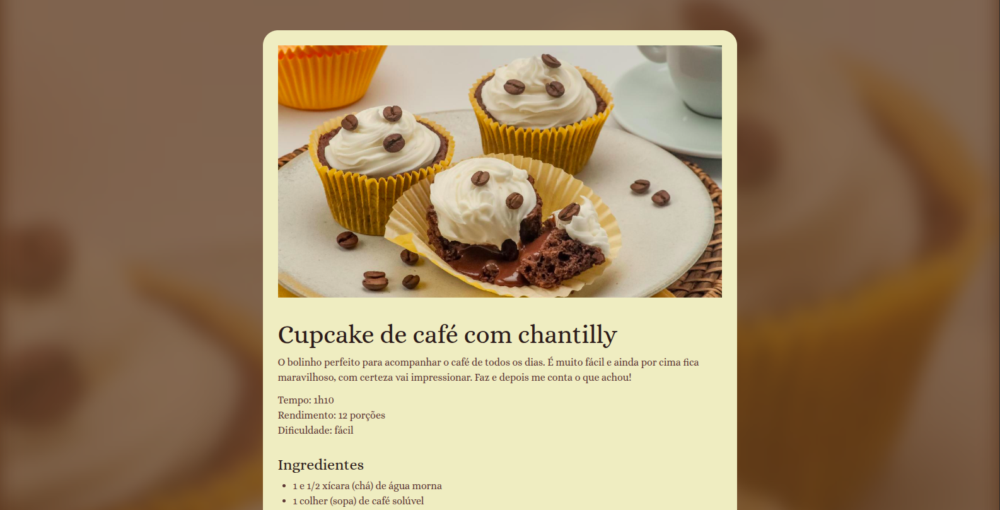

# 🧁 CakePage

Página de receita de **Cupcake de Café com Chantilly** desenvolvida para praticar os conceitos básicos de HTML e CSS.

<div align="center">
  <!-- Substitua o caminho abaixo pela imagem desejada -->
  
</div>

---

## 📌 Descrição

Projeto criado durante o módulo **Iniciando o HTML e CSS** da trilha **Full Stack** da [Rocketseat](https://www.rocketseat.com.br/).

Durante o desenvolvimento, exercitei conceitos fundamentais como:

- Anatomia de tags HTML
- Fluxo do HTML
- Atributos
- Elementos de conteúdo e estruturais
- Seletores e combinadores CSS
- Especificidade
- Box Model
- Fontes, textos, cores e fundos

Além disso, incrementei o projeto original com:

- **Uso de variáveis CSS**
- **Responsividade**

---

## 🛠️ Tecnologias Utilizadas

- HTML5
- CSS3

---

## 📂 Como usar

1. Clone este repositório:
    ```bash
    git clone https://github.com/luc4svale/cakepage.git
    ```

2. Acesse o diretório:
    ```bash
    cd cakepage
    ```

3. Abra o `index.html` no navegador.

> Nenhuma instalação extra é necessária — o projeto é 100% front-end.

---

## 📚 Aprendizados

Esse projeto me ajudou a consolidar os conceitos fundamentais de HTML e CSS, além de experimentar recursos como variáveis CSS e responsividade.

---

## 📄 Licença

Este projeto está sob a licença MIT.

---

## 🔗 Acesse

> 💻 Você pode testar o projeto [**clicando aqui**](https://luc4svale.github.io/cakepage/)
